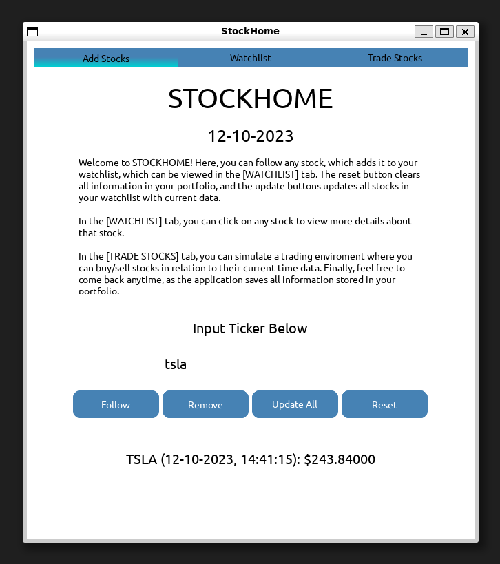
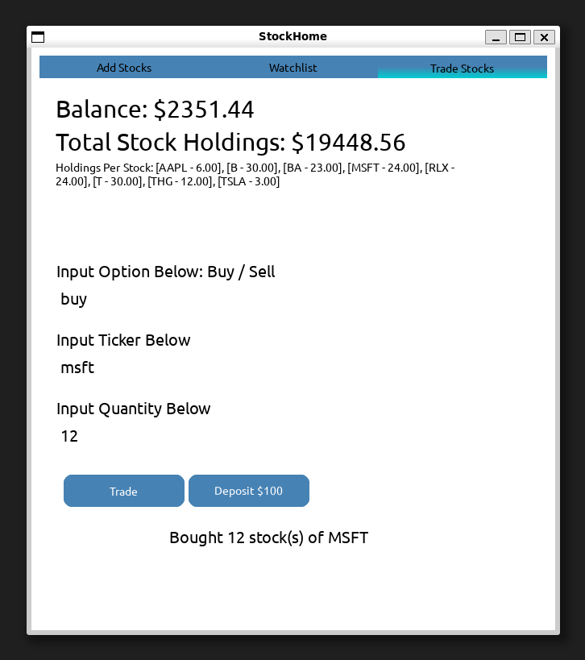

# CS-3110 Final Project - StockHome
This is a OCaml/Python program that pulls stock data from the Yahoo Finance API for a user to manipulate or track. Using data from the API, a user can build a portfolio, track stock data, save and write configurations, and more. 
-----------------------------------

## Setup and Dependencies
Requires Python 3.6+, pip3, and Pandas 1.5.3 (yahoo_fin dependencies).
After downloading source code, run `make dependencies` in command line. After everything sucessfully downloads, you can run `make gui` in the command line to run the actual program.

*For more detailed instructions, check `INSTALL.md`.*

## Makefile
The Makefile has several commands that can be used, such as:

- `make dependencies` : Downloads all releveant dependencies from the terminal
- `make gui`: Executes gui.ml to create a GUI window running the application
- `make lines` : Returns line count of project (run `sudo apt install cloc` first)

And others.

## Project Members 
- Ryan Wu rw645@cornell.edu 
- Leo Lu ll865@cornell.edu 
- Bodong Liu bl576@cornell.edu 
- Bhuwan Bhattarai bb623@cornell.edu 
